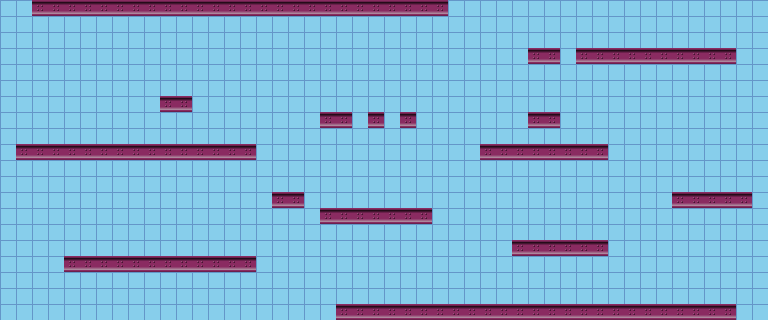

# 

# Bounce Back — реверс-инжиниринг и подготовка порта на PSP

> ⚠️ **Vibe Coding** 
> Часть кода написана в режиме *vibe coding*.  
> Использовались: **Gemini**, **Codex**, **Cursor**.  
> Требуется внимательный review перед production-использованием.


Данный репозиторий содержит материалы по реверс-инжинирингу мобильной игры **Bounce Back** (J2ME / Nokia S60), а также вспомогательные инструменты, используемые для анализа оригинальных ресурсов и подготовки возможного порта на **Sony PSP (PSPSDK, C/C++)**.

Проект **не содержит играбельной версии игры** и **не предназначен для распространения оригинальных ассетов**.  
Оригинальный код и ресурсы присутствуют **исключительно в исследовательских и аналитических целях**.

---

## Аудит соответствия (Compliance Audit)

Проведён детальный аудит соответствия C-порта (PSP) с оригиналом (J2ME).  
Результаты: [COMPLIANCE_AUDIT.md](COMPLIANCE_AUDIT.md)

**Ключевые выводы:**
- **5 критических расхождений**: bounce decay (75% vs 50%), отсутствие прогрессии уровней, отсутствие Game Over, враги не рендерятся, трансформации тайлов не применяются в основном проходе.
- **7 значительных расхождений**: отсутствие рендера двери/hoops/оверлеев, неправильный alpha водных тайлов, захардкоженный цвет фона, отсутствие таймера уровня.
- **Полное совпадение**: все 12 констант физики, пиксельная коллизия, 3 типа врагов (AI), 6 типов колец, тайловые эффекты, сбор предметов/очки, пружины, конвейеры.

**Рекомендация:** Порт требует значительных исправлений для достижения pixel-perfect соответствия и полной игры.

---

## Текущий статус проекта

### Реализовано (базовый движок, технодемо)

**Код:** `src/*.c`, `src/*.h`, `Makefile`

- ✅ **PSP инициализация** (callbacks, HOME button)
- ✅ **SDL2 + SDL2_image** инициализация
- ✅ **ResourceLoader** для c.java контейнеров (big-endian)
- ✅ **Загрузка уровней** (`level_loader.c`) из /res/lf
- ✅ **Загрузка тайлсетов** (`tileset_loader.c`) из /res/if0, /res/if1
- ✅ **Метаданные тайлов** (`tile_metadata.c`) из /res/tf
- ✅ **Анимация тайлов** (`tile_animation.c`) - renderType=3, 50ms tick
- ✅ **Рендеринг уровней** (`level_renderer.c`) с правильными текстурами
- ✅ **Система коллизий** (`collision.c`) с масками 16×16
- ✅ **Физика игрока** (`player.c`) - гравитация, прыжки, движение
- ✅ **Ввод** (`input.c`) - клавиатура (влево/вправо/прыжок)
- ✅ **Камера** (`camera.c`) - плавное следование за игроком
- ✅ **Игровой цикл** (50ms tick, 20 FPS)

**Сборка:**
```bash
# В WSL/Linux (требуется $PSPDEV)
make
```

> Примечание: `make` копирует оригинальные ресурсы из `original_code/bounce_back_s60.jar.src/res/` в `release/res/`.  
> Путь можно переопределить: `make ORIGINAL_RES_DIR=/path/to/res`.

**Результат:** `release/EBOOT.PBP` - **технодемо** с базовым движением по уровню (только тайлы и физика)

### Следующие этапы (НЕ РЕАЛИЗОВАНО)

**Критичные для геймплея:**
- ❌ Враги (отсутствуют полностью)
- ❌ Бонусы (монеты, звезды, powerups)
- ❌ Специальные тайлы (батуты, телепорты, движущиеся платформы)
- ❌ Смерть и респавн игрока
- ❌ Победа уровня (выход)
- ❌ UI и HUD (очки, жизни, таймер)

**Дополнительно:**
- Анимация спрайтов игрока (ball sprite states)
- Звук и музыка
- Меню и навигация по уровням

### Общая информация

- Стадия: **базовый движок** (движение, коллизии, анимация тайлов)
- Целевая платформа: Sony PSP (PSPSDK, C, SDL2)
- Язык реализации: C (PSP toolchain, WSL/Linux build)
- Конвертация ассетов: не выполняется (прямое чтение оригинальных c.java контейнеров)
- **Геймплей**: отсутствует (нет врагов, бонусов, побед/поражений)

---

## Правила порта на PSP

### 1. Расширение экрана до размеров PSP

**Оригинал (J2ME):** 176×208 пикселей  
**PSP:** 480×272 пикселей

**Решение:**
- Увеличиваем viewport (обзор на уровень) без изменения размера тайлов
- **Pixel-perfect рендеринг** уровня сохраняется (16×16 тайлы остаются 16×16)
- Игрок видит больше игрового пространства (wider field of view)
- UI масштабируется или перепозиционируется под широкий экран

**Viewport:**
- J2ME: ~11×13 тайлов (176÷16 × 208÷16)
- PSP: ~30×17 тайлов (480÷16 × 272÷16)

### 2. Камера и физика камеры

**Источник:** `bounce_zero/src/camera.c` и `bounce_zero/src/camera.h`

**Принципы:**
- Плавное следование за игроком (smooth camera)
- Deadzone (мертвая зона) в центре экрана
- Ограничения по границам уровня (clamp/wrap)
- Поддержка shake эффектов

**Интеграция:**
- Использовать готовую реализацию из bounce_zero
- Адаптировать под размеры PSP viewport (480×272)
- Синхронизировать с tick rate 50ms (20 FPS)

---

## Структура репозитория


> Примечание: каталог `original_code/` намеренно не публикуется в GitHub. Он используется локально как исследовательский материал.

```
.
├── original_code/               # Извлечённые и декомпилированные исходники J2ME (исследование)
│   └── bounce_back_s60.jar.src/
│       ├── *.java               # Логика игры, UI, движок, физика
│       └── res/                 # Оригинальные бинарные ресурсы (lf, tf, if*, bg, b, r и др.)
│
├── src/                         # ✅ Реализация порта на PSP (C + SDL2)
│   ├── main.c                   # Главный файл: инициализация, игровой цикл (50ms tick)
│   ├── resource_loader.[ch]     # Загрузка c.java контейнеров (big-endian)
│   ├── level_loader.[ch]        # Парсинг уровней из /res/lf (tileMap, spawn, size)
│   ├── tileset_loader.[ch]      # Загрузка PNG текстур из /res/if0, /res/if1
│   ├── tile_metadata.[ch]       # Метаданные тайлов из /res/tf (renderType, imageIndex, collision)
│   ├── tile_animation.[ch]      # Система анимации тайлов (renderType=3, tick 50ms)
│   ├── level_renderer.[ch]      # Рендеринг уровня (tileMap → экран, анимации)
│   ├── collision.[ch]           # Тесты коллизий (g.collisionTest)
│   ├── collision_masks.[ch]     # Загрузка и проверка масок коллизий 16×16
│   ├── player.[ch]              # Физика игрока (гравитация, прыжки, движение)
│   ├── input.[ch]               # Обработка ввода (влево/вправо/прыжок)
│   ├── camera.[ch]              # Камера с плавным следованием
│   └── Makefile                 # Сборка для PSPSDK (WSL/Linux)
│
├── docs/
│   ├── DEOBFUSCATION.md             # Справочник по деобфускации: классы/поля/форматы ресурсов
│   ├── GAME_LOOP_SPEC.md            # "Исполняемая модель" тика 50ms (контракт game loop)
│   ├── COLLISION_CONTRACT.md        # Контракт коллизий (g.collisionTest): collisionType/transform/aux + кейсы
│   ├── MEMORY_ANALYSIS.md           # Анализ памяти/VRAM и рекомендации
│   ├── original-code-review.md      # Заметки по обзору исходников/архитектуры
│   ├── tile_types_documentation.md  # Документация по типам тайлов и коллизиям
│   ├── STEP_01_BRING_UP.md          # ✅ Шаг 1: Инициализация SDL2, загрузка ресурсов
│   ├── STEP_02_TILE_ENGINE.md       # ✅ Шаг 2: Загрузка и рендеринг уровней
│   ├── STEP_03_PLAYER_PHYSICS.md    # ✅ Шаг 3: Физика игрока
│   ├── STEP_04_COLLISIONS.md        # ✅ Шаг 4: Система коллизий
│   ├── STEP_05_INPUT.md             # ✅ Шаг 5: Обработка ввода
│   ├── STEP_06_CAMERA.md            # ✅ Шаг 6: Камера
│   └── STEP_07_TILE_ANIMATION.md    # ✅ Шаг 7: Анимация тайлов
│
├── artifacts/
│   ├── tile_mapping_table.txt                   # Табличное представление свойств тайлов
│   ├── lf_enemies_dump.txt                      # Сгенерированный текстовый дамп врагов по всем уровням
│   ├── lf_tile_positions_collision_cases.txt    # Сгенерированные позиции tileId для collision кейсов
│   ├── tf_tiles_dump.txt                        # Сгенерированный дамп метаданных /res/tf (все тайлы)
│   ├── tf_inline_masks_runtime.txt              # Сгенерированные inline-маски (runtime-ориентация)
│   ├── res_container_signatures.txt             # Сигнатуры chunk'ов /res/* (PNG/unknown), для проверки форматов
│   └── tile_counts_report.txt                   # Сгенерированная статистика тайлов (вывод count_tiles_on_levels.py)
│
├── scripts/
│   ├── generate_maps_from_lf.py                 # Парсер уровней (res/lf) и сборка карт
│   ├── parse_tf_textures&animations.py          # Анализ формата тайлов (res/tf), анимаций и флагов
│   ├── count_tiles_on_levels.py                 # Статистика распределения тайлов по уровням
│   ├── dump_lf_enemies.py                       # Дамп enemy records из /res/lf (9 байт) + нормализация как в h.b(level)
│   ├── dump_lf_tile_positions.py                # Поиск tileId по уровням (/res/lf tileMap): позиции и флаг 0x80
│   ├── dump_tf_tiles.py                         # Дамп /res/tf: v/T/transform/collisionType/aux (+ вывод inline mask)
│   ├── dump_res_container_signatures.py         # Определение форматов chunk'ов в /res/* (PNG/JPEG/raw), для bring-up
│   ├── tile_to_texture_mapping.py               # Соответствие ID тайлов и графических ресурсов
│   ├── analyze_memory_requirements.py           # Анализ требований к памяти (PSP)
│   └── analyze_splash_screens.py                # Анализ заставок/меню/UI (PSP)
├── gifs/                        # Визуализация уровней (отладочные GIF)
├── release/                     # ✅ Результаты сборки (EBOOT.PBP + res/)
└── README.md                    # Текущая документация проекта
```

---

## Назначение Python-скриптов

Все Python-скрипты в репозитории предназначены для **анализа и воспроизведения логики загрузки ресурсов**, реализованной в оригинальном J2ME-коде.

Их задача — зафиксировать формат данных и поведение движка, чтобы в дальнейшем реализовать эквивалентную логику на PSPSDK без конвертации ассетов.

- [`DEOBFUSCATION.md`](docs/DEOBFUSCATION.md)  
  Сводный “справочник по именам”: какие классы за что отвечают, какие поля что значат, и какие форматы `/res/*` уже подтверждены.

- [`GAME_LOOP_SPEC.md`](docs/GAME_LOOP_SPEC.md)  
  50ms tick как контракт порта: порядок стадий `h.run()`, pipeline ввода press/release → `inputMask`, и что жёстко привязано к тику.

- [`COLLISION_CONTRACT.md`](docs/COLLISION_CONTRACT.md)  
  Самая рискованная часть порта: точная семантика `g.collisionTest(...)`, `collisionType`, `transform`, `aux`-alias, ориентация масок, и минимальные проверяемые кейсы из реальных уровней.

- Пошаговая документация (`docs/STEP_*.md`):  
  Детальное описание каждого этапа реализации порта: от инициализации SDL2 до анимации тайлов. Каждый шаг содержит спецификацию формата данных, алгоритмы и контракты.

- `scripts/generate_maps_from_lf.py`  
  Десериализация уровней из `res/lf`, сборка тайловых карт и проверка структуры данных.

- `scripts/parse_tf_textures&animations.py`  
  Анализ формата `res/tf`: свойства тайлов, типы коллизий, анимации, флаги трансформаций.

- `scripts/count_tiles_on_levels.py`  
  Сбор статистики использования тайлов по всем уровням.

- [`dump_lf_enemies.py`](scripts/dump_lf_enemies.py)  
  Дамп “врагов/moving objects” из `/res/lf` (каждый объект — 9 байт), включая нормализацию координат/скоростей как в `h.b(level)`. Нужен, чтобы порт врагов не был гаданием.

- [`dump_lf_tile_positions.py`](scripts/dump_lf_tile_positions.py)  
  Поиск tileId по всем уровням в tileMap (/res/lf): выдаёт позиции (tileX,tileY) и флаг `0x80` (bg-fill). Нужен, чтобы привязывать “тайл X реально встречается вот здесь” в документах/контрактах.

- [`dump_tf_tiles.py`](scripts/dump_tf_tiles.py)  
  Текстовый дамп `/res/tf` (метаданные тайлов): `renderType`, `imageIndex`, `transform`, `collisionType`, `aux`, и (опционально) inline-маски в **runtime-ориентации**. Нужен, чтобы `docs/COLLISION_CONTRACT.md` опирался на проверяемые артефакты.

- [`dump_res_container_signatures.py`](scripts/dump_res_container_signatures.py)  
  Проверка форматов chunk’ов в `/res/*` (контейнеры и raw файлы): помогает доказать “это PNG” до переноса декодера на PSP.

- `scripts/tile_to_texture_mapping.py`  
  Связь логических ID тайлов с графическими ресурсами (`if0`, `if1`, `ic`).

---

## Документация по тайлам (контент/поведение)

- [`tile_types_documentation.md`](docs/tile_types_documentation.md)  
  Конкретные tileId и их поведение (триггеры, бонусы, “спешалы”), с привязкой к исходникам.

- [`tile_mapping_table.txt`](artifacts/tile_mapping_table.txt)  
  Быстрая таблица “tileId → текстура/слой/параметры” для ручной проверки и сопоставления.

---

## Сгенерированные дампы (чтобы не забыть, откуда “факты”)

Эти файлы — **не ручные заметки**, а воспроизводимые артефакты, сгенерированные из оригинальных ресурсов в `original_code/.../res/*`. Их удобно ссылать в документации, чтобы любые утверждения можно было перепроверить.

- [`lf_enemies_dump.txt`](artifacts/lf_enemies_dump.txt)  
  Полный дамп врагов по уровням:  
  `python3 scripts/dump_lf_enemies.py --out artifacts/lf_enemies_dump.txt`

- [`tf_tiles_dump.txt`](artifacts/tf_tiles_dump.txt)  
  Полный дамп метаданных `/res/tf`:  
  `python3 scripts/dump_tf_tiles.py > artifacts/tf_tiles_dump.txt`

- [`tf_inline_masks_runtime.txt`](artifacts/tf_inline_masks_runtime.txt)  
  Inline‑маски (runtime‑ориентация) для выбранных tileId:  
  `python3 scripts/dump_tf_tiles.py --dump-mask 3 --dump-mask 52 --dump-mask 97 > artifacts/tf_inline_masks_runtime.txt`

- [`res_container_signatures.txt`](artifacts/res_container_signatures.txt)  
  Сигнатуры chunk’ов `/res/*` (PNG/unknown + head bytes):  
  `python3 scripts/dump_res_container_signatures.py > artifacts/res_container_signatures.txt`

- [`lf_tile_positions_collision_cases.txt`](artifacts/lf_tile_positions_collision_cases.txt)  
  Позиции tileId в уровнях (для кейсов в `docs/COLLISION_CONTRACT.md`):  
  `python3 scripts/dump_lf_tile_positions.py --tile 4 --tile 53 --tile 102 > artifacts/lf_tile_positions_collision_cases.txt`

- [`tile_counts_report.txt`](artifacts/tile_counts_report.txt)  
  Статистика tileId по всем уровням:  
  `python3 scripts/count_tiles_on_levels.py > artifacts/tile_counts_report.txt`

---

## Анализ требований к памяти

- [`MEMORY_ANALYSIS.md`](docs/MEMORY_ANALYSIS.md)  
  Полный анализ требований к памяти для PSP: размеры ресурсов, распакованных текстур, runtime overhead, VRAM allocation, рекомендации по оптимизации.  
  **Результат:** все ресурсы занимают менее 1% памяти PSP (0.2-0.6 MB из 24 MB).

- [`analyze_memory_requirements.py`](scripts/analyze_memory_requirements.py)  
  Скрипт анализа контейнеров, уровней и общих требований к памяти:  
  `python3 scripts/analyze_memory_requirements.py`

- [`analyze_splash_screens.py`](scripts/analyze_splash_screens.py)  
  Детальный анализ заставок, меню и UI элементов (размеры в RGBA32/RGB565/RGBA4444):  
  `python3 scripts/analyze_splash_screens.py`

---

## Оригинальный код

Каталог `original_code/` содержит декомпилированные исходники J2ME-версии игры.

Они используются для:
- анализа архитектуры игры;
- восстановления форматов бинарных ресурсов;
- сопоставления логики движка с результатами парсинга данных.

Код **не модифицируется** и **не используется напрямую** в конечной реализации.

---

## Юридическая оговорка

Все товарные знаки, названия и оригинальные ресурсы принадлежат их правообладателям.

Данный репозиторий предназначен **исключительно для исследовательских и образовательных целей** (reverse engineering, software preservation).

---

## PSP порт (PSPSDK) - текущий статус

**Статус:** Активная разработка, проведён аудит соответствия ([COMPLIANCE_AUDIT.md](COMPLIANCE_AUDIT.md)).

### Реализовано
- ✅ Базовый рендер тайлов и спрайтов (SDL2)
- ✅ Физика игрока (все 12 констант совпадают с оригиналом)
- ✅ Пиксельная коллизия (маски, трансформации)
- ✅ Камера и скроллинг
- ✅ Ввод (клавиатура PSP)
- ✅ HUD (очки, жизни, предметы)
- ✅ Анимации тайлов (water, conveyor)
- ✅ Маски игрока (ресурс B)
- ✅ Трансформации для больших колец (collision transforms)
- ✅ Загрузка уровней (LF формат)

### Отсутствует / Требует исправлений
- ❌ Прогрессия уровней (нет перехода между уровнями)
- ❌ Game Over экран (нет обработки смерти)
- ❌ Рендер врагов (AI присутствует, но не отображаются)
- ❌ Рендер двери/hoops/оверлеев (не рендерятся в foreground pass)
- ❌ Таймер уровня (отсутствует)
- ❌ Правильный alpha для водных тайлов (непрозрачность)
- ❌ Правильный цвет фона (захардкожен, адаптация для PSP)
- ❌ Трансформации тайлов в основном проходе (отсутствуют)
- ❌ Bounce decay (критический баг: 75% вместо 50%)

### Технические детали
- **Язык:** C (PSPSDK toolchain)
- **Графика:** SDL2 (PSP SDL port)
- **Звук:** Пока не реализован
- **Размер:** ~2MB (PSP EBOOT.PBP)
- **Совместимость:** PSP-1000/2000/3000
